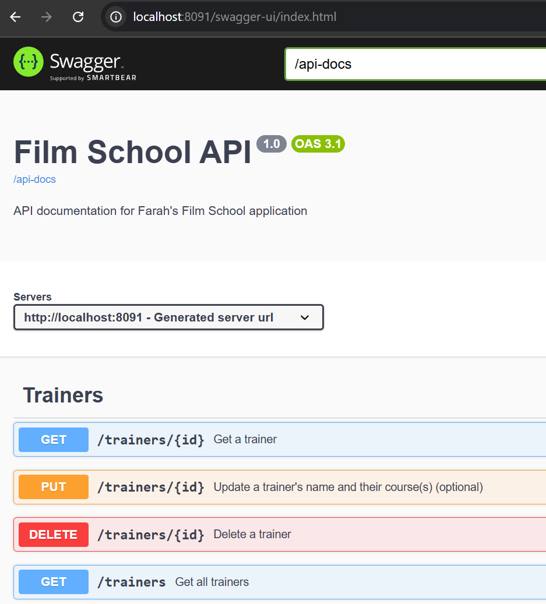
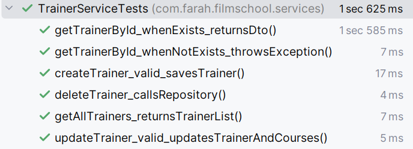

# Film School API

Welcome to Farah's Film School REST API project! This is a Java Spring Boot application that connects to a PostgreSQL database. It's designed to mimic an API that a film school might use to manage courses and trainers. Read on for more info!

## Tech stack

- **Language**: Java 21
- **App framework**: Spring Boot 3.5.5
- **Data persistence layer**: Spring Data JPA
- **Production database**: PostgreSQL
- **Testing database**: in-memory H2
- **Testing framework**: JUnit 5 & Mockito
- **API documentation**: SpringDoc OpenAPI
- **Build tool**: Maven
- **Containerisation**: Docker
- **CICD pipeline**: Jenkins

## Database

The database contains a trainers and a courses table, which are linked and preloaded with some data.
- Trainers table:

- Course table:

## Interacting with the API

You can perform full CRUD operations on the tables via a Swagger UI, accessible on *http://your-IP-address>:8091/swagger-ui/index.html*

## Testing

Unit tests make use of Mockito and cover happy paths and edge cases for the application's services. They are available here and can be run with `./mvnw test -Dtest=TrainerServiceTests,CourseServiceTests` (no need to have Maven installed, as this command uses the wrapper).

## Instructions for running the app

The application is fully Dockerised. You can run it locally by:
1. Copying the [Docker Compose file](docker-compose.yml) to a machine where Docker is installed ([instructions for this here](https://docs.docker.com/engine/install/))
2. Creating a `.env` file (in the same directory as the Docker Compose file) that contains values for `POSTGRES_PASSWORD` and `SPRING_DATASOURCE_PASSWORD` (this is necessary as the Docker Compose file doesn't hard-code these values for security). Example here: 
3. Running `docker compose up -d` in the directory where it is located
- You will then be able to access the app on *http://your-IP-address>:8091/swagger-ui/index.htm*

## CICD

A comprehensive CICD pipeline automating the entire software delivery process has been built on Jenkins for this app. It's triggered by a push to the *dev* branch of this repo, and runs stages to alert Slack channels, run Maven tests, merge to the *main* branch (with conflict detection), build the application, create and push a new Docker image to Docker Hub, and finally to deploy the app on a VM via SSH. Stay tuned for a video demo!